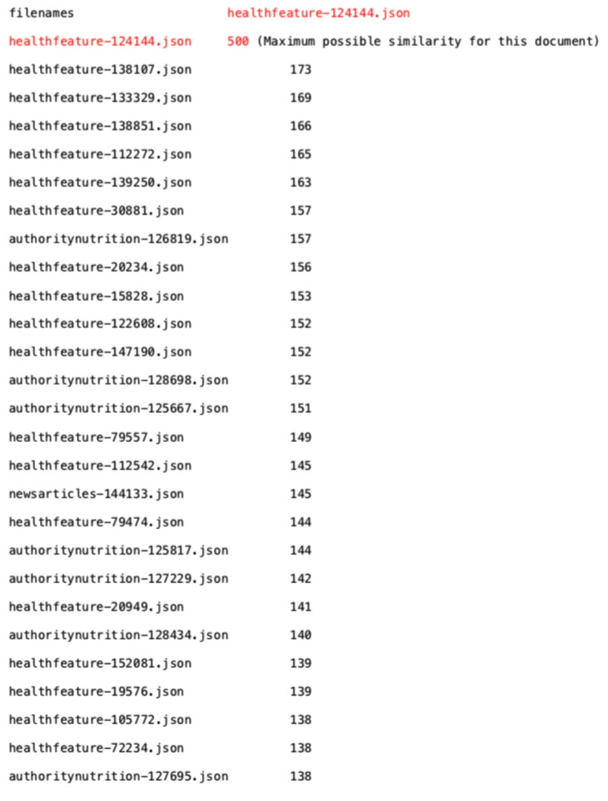

# Doc2Doc-Comparison-using-Word2Vec-Model
Deep Learning Project [UCSC Silicon Valley Extension: Deep Learning and Artificial Intelligence with TensorFlow]
- Cowork with Santosh Honnavalli

## Project Overview
### Project Description
Identify the similarity among two thousands of documents based on the Word2Vec skip-gram model.

### Project Procedure
- Prepare the data
  - Collect 40000 documents
- Preprocesse the data
  - Remove non-English words
  - Remove stopwords
  - Tokenization
  
  (Data_preparion1.py) 
  (Data_preparion2.py)
- Build Word2Vec model
- Train the  model
- Doc2Doc comparison

  (Doc2Doc_comparison.py)
- Verify results by exact word match count

  (match_word_count.py)
### Project Results
- Trained the Word2Vec (Skip-gram) model by collecting vocabularies from 40000 documents and compared similarity among 2000 documents successfully based on output of word_match_count validation.
- Obtained the similarity of words by Word2Vec model and further compare all the words in a document to another document to decide the Doc2Doc similarity by adding similarity of “most similar” words together. 
- Get all the similarity value among all documents. The higher value of similarity, the more similar the two documents are. 
- Word2Vec Visualization

 
 
- Loss graph

 
 
- Comparison output

 
 
 - word_match_count output (verify Word2Vec model accuracy)
 
  


## Getting Started
### Prerequisites

This project requires **Python 3.6** and the following Python libraries installed:

- [NumPy](http://www.numpy.org/)
- [matplotlib](http://matplotlib.org/)
- [scikit-learn](http://scikit-learn.org/stable/)
- [tensorflow](https://www.tensorflow.org/install/pip)

(Optional) If you are using AWS, use python 3.6 on AWS EC2 instance p2.xlarge which has tensorflow and GPU support.
- It has 4 vCPUs with 61GB RAM. We recommend machines of at least this configuration to run our program in reasonable time - for 2000 documents and top 500 words in each document the run took ~4 hours.

### Run

In a terminal or command window, run one of the following commands:

```bash
python Doc2Doc_comparison.py
```  

### Data

40000 healthcare related documents are using a private dataset
